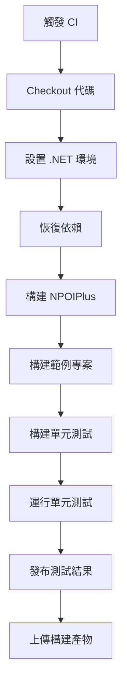
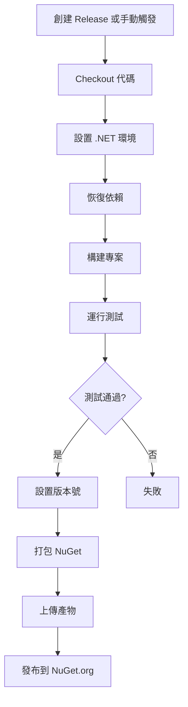
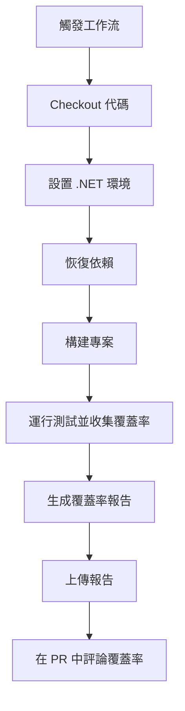

# CI/CD 設置指南 / CI/CD Setup Guide

本文檔說明如何設置和使用 NPOIPlus 的 CI/CD 流程。
This document explains how to setup and use the CI/CD pipeline for NPOIPlus.

## 📋 目錄 / Table of Contents

- [概述 / Overview](#概述--overview)
- [GitHub Actions 工作流 / GitHub Actions Workflows](#github-actions-工作流--github-actions-workflows)
- [設置步驟 / Setup Steps](#設置步驟--setup-steps)
- [工作流詳解 / Workflow Details](#工作流詳解--workflow-details)
- [常見問題 / FAQ](#常見問題--faq)

---

## 概述 / Overview

NPOIPlus 使用 GitHub Actions 來實現自動化的 CI/CD 流程，包括：

NPOIPlus uses GitHub Actions for automated CI/CD, including:

- ✅ 自動構建 / Automated builds
- ✅ 單元測試 / Unit tests
- ✅ 代碼覆蓋率 / Code coverage
- ✅ 代碼質量分析 / Code quality analysis
- ✅ 自動發布 NuGet 套件 / Automated NuGet package publishing
- ✅ 依賴更新管理 / Dependency management

## GitHub Actions 工作流 / GitHub Actions Workflows

### 1. CI Workflow (`.github/workflows/ci.yml`)

**觸發條件 / Triggers:**
- Push 到 `main` 或 `develop` 分支
- Pull Request 到 `main` 或 `develop` 分支

**執行內容 / Actions:**
- 檢出代碼 / Checkout code
- 設置 .NET 環境 / Setup .NET environment
- 恢復依賴 / Restore dependencies
- 構建專案 / Build projects
- 運行單元測試 / Run unit tests
- 發布測試結果 / Publish test results
- 上傳構建產物 / Upload build artifacts

### 2. Publish Workflow (`.github/workflows/publish.yml`)

**觸發條件 / Triggers:**
- 發布新的 Release
- 手動觸發（可指定版本號）

**執行內容 / Actions:**
- 構建專案 / Build project
- 運行測試 / Run tests
- 打包 NuGet 套件 / Pack NuGet package
- 發布到 NuGet.org / Publish to NuGet.org

### 3. Code Quality Workflow (`.github/workflows/code-quality.yml`)

**觸發條件 / Triggers:**
- Push 到 `main` 或 `develop` 分支
- Pull Request 到 `main` 或 `develop` 分支

**執行內容 / Actions:**
- 代碼分析 / Code analysis
- 測試覆蓋率報告 / Test coverage report
- 生成覆蓋率徽章 / Generate coverage badge
- PR 評論中顯示覆蓋率 / Show coverage in PR comments

## 設置步驟 / Setup Steps

### 1. 首次推送到 GitHub

```bash
# 初始化 Git 倉庫（如果尚未初始化）
git init

# 添加所有文件
git add .

# 提交
git commit -m "Initial commit with CI/CD setup"

# 添加遠程倉庫
git remote add origin https://github.com/your-username/NPOIPlus.git

# 推送到 GitHub
git push -u origin main
```

### 2. 設置 GitHub Secrets

#### 為 NuGet 發布設置 API Key

1. 前往 [NuGet.org](https://www.nuget.org/) 並登入
2. 前往 Account Settings > API Keys
3. 創建新的 API Key
4. 在 GitHub 倉庫設置中：
   - 前往 `Settings` > `Secrets and variables` > `Actions`
   - 點擊 `New repository secret`
   - 名稱：`NUGET_API_KEY`
   - 值：貼上從 NuGet.org 獲得的 API Key
   - 點擊 `Add secret`

### 3. 啟用 GitHub Actions

GitHub Actions 會在您第一次推送包含 `.github/workflows` 目錄的代碼後自動啟用。

您可以在倉庫的 `Actions` 標籤頁中查看工作流執行狀態。

### 4. 設置分支保護（可選但推薦）

1. 前往 `Settings` > `Branches`
2. 點擊 `Add rule`
3. 分支名稱模式：`main`
4. 啟用以下選項：
   - ✅ Require a pull request before merging
   - ✅ Require status checks to pass before merging
   - ✅ Require branches to be up to date before merging
   - 選擇必須通過的檢查：
     - ✅ Build and Test
     - ✅ Code Analysis
5. 點擊 `Create`

## 工作流詳解 / Workflow Details

### CI 工作流執行流程



### 發布工作流執行流程



### 代碼覆蓋率工作流



## 使用指南 / Usage Guide

### 如何觸發 CI

CI 會在以下情況自動運行：

1. **Push 代碼到 main/develop 分支**
   ```bash
   git push origin main
   ```

2. **創建 Pull Request**
   - 在 GitHub 上創建 PR 到 main 或 develop 分支

### 如何發布新版本

#### 方法 1：通過 GitHub Release（推薦）

1. 前往倉庫的 `Releases` 頁面
2. 點擊 `Draft a new release`
3. 填寫資訊：
   - Tag version: `v1.0.0`（必須以 v 開頭）
   - Release title: `Version 1.0.0`
   - Description: 填寫更新說明
4. 點擊 `Publish release`
5. GitHub Actions 會自動：
   - 構建專案
   - 運行測試
   - 打包 NuGet
   - 發布到 NuGet.org

#### 方法 2：手動觸發

1. 前往倉庫的 `Actions` 標籤頁
2. 選擇 `Publish to NuGet` 工作流
3. 點擊 `Run workflow`
4. 輸入版本號（例如：1.0.0）
5. 點擊 `Run workflow`

### 查看 CI 狀態

#### 在 Pull Request 中
- PR 頁面會顯示所有檢查的狀態
- 點擊 `Details` 可查看詳細日誌

#### 在 Actions 標籤頁
- 查看所有工作流的執行歷史
- 查看詳細日誌
- 下載構建產物

### 查看代碼覆蓋率報告

1. 前往 `Actions` 標籤頁
2. 選擇 `Code Quality` 工作流的一次運行
3. 在 `Artifacts` 區域下載 `coverage-report`
4. 解壓縮後開啟 `index.html` 查看完整報告

在 Pull Request 中，覆蓋率摘要會自動作為評論顯示。

## Dependabot 設置

Dependabot 已配置為自動檢查和更新依賴：

- **NuGet 套件**：每週一上午 9:00（台北時間）
- **GitHub Actions**：每週一上午 9:00（台北時間）

當發現新版本時，Dependabot 會自動創建 PR。

### 自定義 Dependabot

編輯 `.github/dependabot.yml` 文件來調整設置：

```yaml
schedule:
  interval: "weekly"  # 可改為 daily, weekly, monthly
  day: "monday"       # 星期幾
  time: "09:00"       # 時間
  timezone: "Asia/Taipei"  # 時區
```

## 徽章 / Badges

在 README.md 中添加狀態徽章：

```markdown


[](https://www.nuget.org/packages/NPOIPlus/)
[](https://www.nuget.org/packages/NPOIPlus/)
```

## 常見問題 / FAQ

### Q: 測試失敗導致 CI 失敗怎麼辦？

A: 
1. 查看 Actions 標籤頁的詳細日誌
2. 在本地運行測試：`dotnet test`
3. 修復問題後重新提交

### Q: NuGet 發布失敗怎麼辦？

A: 檢查：
1. NUGET_API_KEY Secret 是否正確設置
2. API Key 是否有效且未過期
3. 套件名稱是否已被占用
4. 版本號是否已存在

### Q: 如何跳過 CI？

A: 在 commit message 中添加 `[skip ci]` 或 `[ci skip]`：

```bash
git commit -m "Update docs [skip ci]"
```

### Q: 如何在本地測試工作流？

A: 使用 [act](https://github.com/nektos/act) 工具：

```bash
# 安裝 act
choco install act-cli

# 運行 CI 工作流
act -j build
```

### Q: 工作流運行太慢怎麼辦？

A: 優化建議：
1. 使用緩存依賴
2. 並行運行測試
3. 減少不必要的步驟
4. 使用更快的 runner（如 GitHub hosted runners）

### Q: 如何添加其他 .NET 版本的測試？

A: 編輯 `ci.yml`，在 `setup-dotnet` 步驟添加版本：

```yaml
- name: Setup .NET
  uses: actions/setup-dotnet@v4
  with:
    dotnet-version: |
      6.0.x
      7.0.x
      8.0.x
      9.0.x  # 添加新版本
```

## 維護 / Maintenance

### 定期檢查事項

- [ ] 每月檢查 GitHub Actions 版本更新
- [ ] 每月檢查 NuGet 套件依賴更新
- [ ] 每季審查 CI/CD 配置是否需要優化
- [ ] 監控構建時間和資源使用

### 更新工作流

當需要修改工作流時：

1. 創建新分支
2. 修改 `.github/workflows/*.yml` 文件
3. 提交並創建 PR
4. 在 PR 中測試工作流
5. 合併到 main 分支

## 資源連結 / Resources

- [GitHub Actions 文檔](https://docs.github.com/en/actions)
- [.NET GitHub Actions](https://github.com/actions/setup-dotnet)
- [NuGet 文檔](https://docs.microsoft.com/en-us/nuget/)
- [Dependabot 文檔](https://docs.github.com/en/code-security/dependabot)

## 支援 / Support

如有問題，請：

1. 查看 [Issues](../../issues)
2. 創建新的 Issue
3. 參考 [CONTRIBUTING.md](CONTRIBUTING.md)

---

**注意 / Note:** 請記得將 `your-username` 替換為您的 GitHub 用戶名！
Remember to replace `your-username` with your actual GitHub username!

